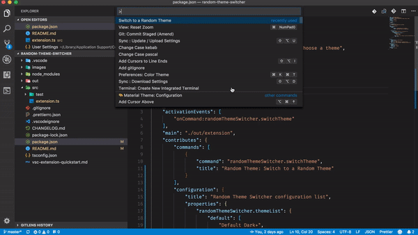

# Random Theme Switcher

A simple extension that chooses and applies a *random* theme.

## Features

### Change theme on command

- Open the command palette and search for `random`
- Choose `Random Theme: Switch to a Random Theme`



### Change theme when code starts

- Open a new window and, after a few seconds, behold the new theme!

## Extension Settings

This extension choos a random theme from a list in the user settngs.

* `randomThemeSwitcher.switchOnOpen`: true or false, __default is true__, change to a random theme when code is opened.

* `randomThemeSwitcher.themeList`: a list of string with labels of themes.

For easy setup use the command __Copy all installed themes in settings__

example:

```
"randomThemeSwitcher.themeList": [
        "Andromeda Italic",
        "Cobalt2",
        "Dracula",
        "Tomorrow Night Blue",
        "Ayu Dark",
        "One Monokai",
        "Night Owl"
],
```


## TODO

- [x] Change theme at startup.
- [x] If no list is provided use the installed themes.
- [ ] Add the current theme to the theme list.
- [ ] Add key chord for changing theme.

## Release Notes

## 0.1.0

- Added command for save current installed themes in settings list.
- If no theme list is provided all the installed themes will be used. 
- Now the current theme cannot be applied when choosing randomly.
- If only one theme is present in the list that theme will be applied (why ???).


## 0.0.2

- Theme now change every time the editor opens

### 0.0.1

- Initial release, can only change the theme via custom palette command.
