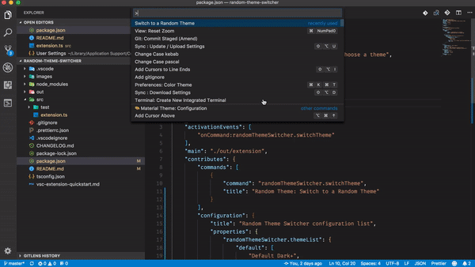

# Random Theme Switcher

A simple extension that chooses and applies a *random* theme.

## Features

* Choose between 5 switch Modes:

| Mode     | Description                                                                         |
| -------- | ----------------------------------------------------------------------------------- |
| manual   | No automatic switch is performed                                                    |
| startup  | When active it will change theme whenever vscode is opened                          |
| daily    | When active it will change theme once a day                                         |
| interval | When active it will change theme every `randomThemeSwitcher.switchInterval` minutes |
| typing   | When active it will change theme every times a keyboard key is pressed              |

> Don't forget to reload VSC for the changes to take effect

* With `randomThemeSwitcher.copyall` command you can copy in batch all the installed themes:
  * You can narrow the themes' side you want to load
  * You can optionally specify an exclude regex for theme names

### Change theme on command

- Open the command palette and search for `random`
- Choose `Random Theme: Switch to a Random Theme`



### Change theme when vscode starts

- Open a new window and, after a few seconds, behold the new theme!

## Extension Settings

- `randomThemeSwitcher.switchOnOpen`: true or false, __default is true__, change to a random theme when vscode is opened.

- `randomThemeSwitcher.themeList`: a list of string with labels of themes.

- `preventReloadThemeList`: some themes, after they are applied, reload the instance. If are present in this list the extension will not set a new random theme after they are applied
  - default to the material theme suite

> __PROTIP:__ For easy setup use the command `Random Theme: Copy all installed themes in settings`

example:

```json
"randomThemeSwitcher.themeList": [
        "Andromeda Italic",
        "Cobalt2",
        "Dracula",
        "Tomorrow Night Blue",
        "Ayu Dark",
        "One Monokai",
        "Night Owl"
]
```

## TODO

- [x] Change theme at startup.
- [x] If no list is provided use the installed themes.
- [x] Add or remove the current theme to the theme list.
- [x] Add key chord for changing theme.

## Release Notes

## 0.2.1

- Externalized the MATERIAL_LIST into a more customizable `preventReloadThemeList`
  - With that users can pick up their favorites theme and have them one more time (instead of being changed immediately) 

## 0.2.0

- Improved the code
- Introduced the `randomThemeSwitcher.switchMode` setting
- Improved the `randomThemeSwitcher.copyall` command:
  - Now you can narrow the themes' side you want to load
  - You can now optionally specify an exclude regex for theme names 

## 0.1.3

- Added key chord for changing theme `cmd+k cmd+shift+t`
- Added command to add and remove current theme from lists

## 0.1.2

- Fixes reload when applying Material Theme.

## 0.1.1

- If no theme list is found all the installed themes will be automatically copied to settings.

## 0.1.0

- Added command for save current installed themes in settings list.
- If no theme list is provided all the installed themes will be used.
- Now the current theme cannot be applied when choosing randomly.
- If only one theme is present in the list that theme will be applied (why ???).

## 0.0.2

- Theme now change every time the editor opens

### 0.0.1

- Initial release, can only change the theme via custom palette command.
